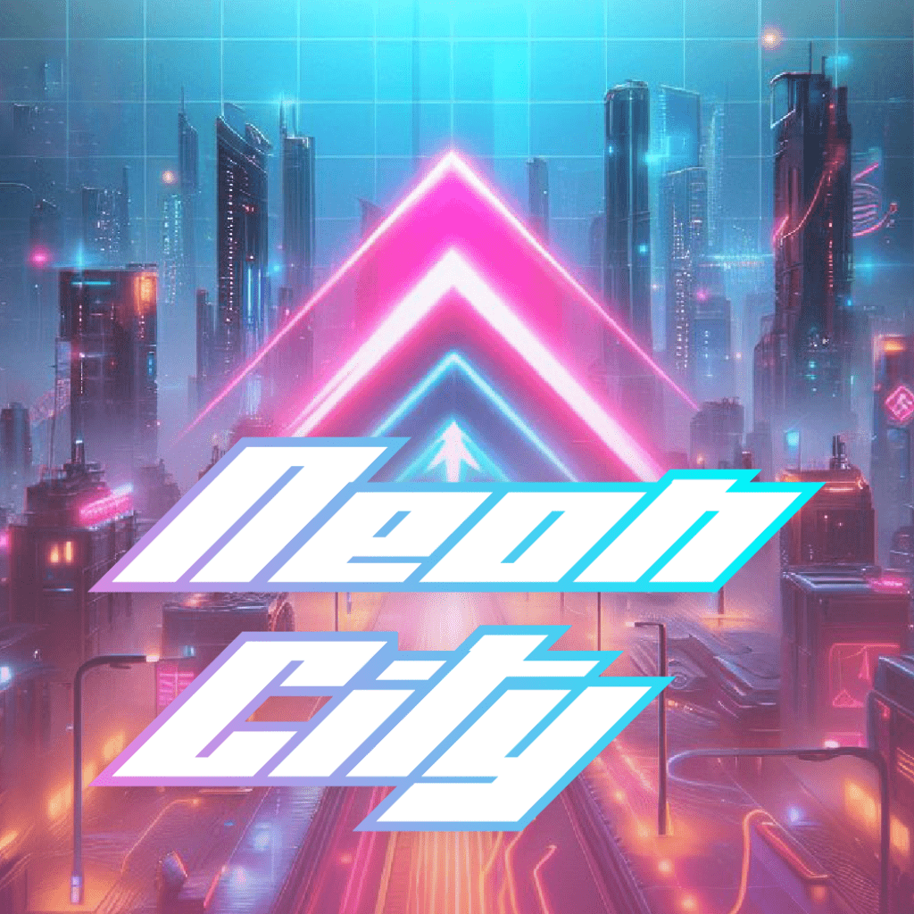
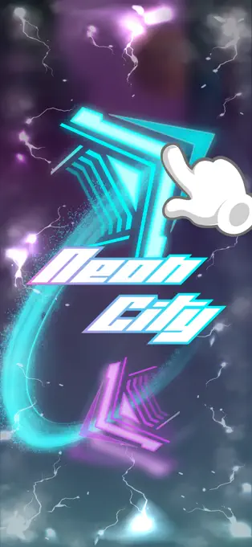
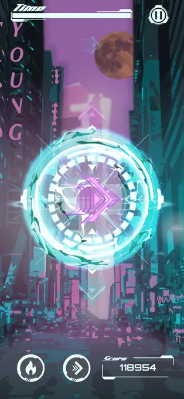
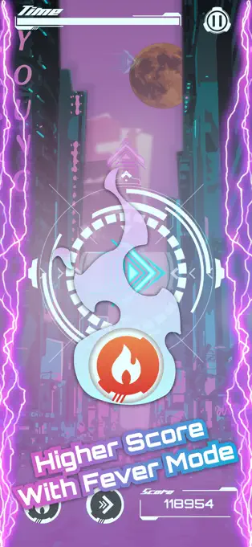
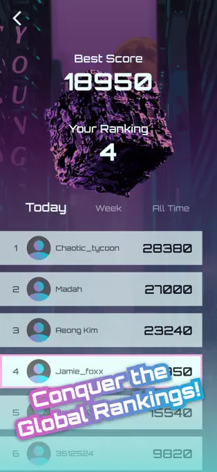

<p align="center">
  
</p>

<h1 align="center">NeonCity: CityRunner</h1>

NeonCity: CityRunner is a high-quality mobile game built with React Native and Expo created by [Daehyeon Mun](https://x.com/daehyeonmun) and [Woojae Lee](https://woojaelee.net/).

## Preview

<p align="center">
  
  
  
  
</p>

## Setup and Run

Follow these steps to set up and run the project on your local machine:

```bash
# Install dependencies
yarn

# Prepare the build environment
yarn prebuild

# Run on Android
yarn android

# OR run on iOS
yarn ios
```

## Download the app

- [App Store](https://apps.apple.com/us/app/neoncity-cityrunner/id6477771151?platform=iphone)
- [Google Play](https://play.google.com/store/apps/details?id=com.justforfun.neoncity)
